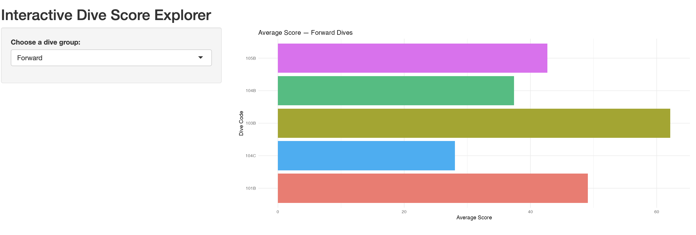

```{r}

# setup: scrape + clean data (hidden from slides)

library(tidyverse)
library(rvest)
library(stringr)
library(readr)

url <- "https://secure.meetcontrol.com/divemeets/system/profile.php?number=67809"
page <- read_html(url)
tables <- page |> html_table(fill = TRUE)

dives_raw <- tables[[3]]
colnames(dives_raw) <- c("dive_height", "description", "high_score", "avg_score", "n_times", "NAcol")

dives <- dives_raw |>
filter(
dive_height != "Dive Statistics",
dive_height != "Dive & Height"
) |>
mutate(
high_score = parse_number(avg_score),
avg_score  = parse_number(n_times),
n_times    = parse_integer(NAcol)
) |>
select(dive_height, description, high_score, avg_score, n_times) |>
mutate(
code_first = str_sub(dive_height, 1, 1),
group = recode(
code_first,
"1" = "Forward",
"2" = "Back",
"3" = "Reverse",
"4" = "Inward",
"5" = "Twist",
.default = NA_character_
)
) |>
filter(!is.na(group))

group_stats <- dives |>
group_by(group) |>
summarise(
mean_avg_score = mean(avg_score),
sd_avg_score   = sd(avg_score),
total_entries  = sum(n_times),
.groups = "drop"
)

```

# Project Overview

-   **Goal:**
    Use past meet results to understand which types of dives are:
    -   scoring best, and most consistent.

    **Approach:**
    -   Scrape my DiveMeets profile
    -   Clean and categorize dives / Summarize performance by dive group
    -   Build a small **Shiny app** to explore results interactively

# The Data

From my DiveMeets “Dive Statistics” page:

-   One row per **unique dive + board** (e.g., 103B on 1m)
-   Columns:
    -   Dive code & description

    -   **Highest score** ever

    -   **Average score** across meets

    -   **\# of times** I’ve competed that dive

# Cleaning & Structuring

To make the data useful, I:

-   Removed extra header rows embedded in the HTML table
-   Fixed columns where:
    -   High score, average score, and counts were misaligned

    -   Converted scores and counts from text to numeric
-   Created a **dive group** variable from the first digit of the dive code:
    -   1 = Forward, 2 = Back, 3 = Reverse, 4 = Inward, 5 = Twist


# Which Groups Score Best?

```{r}

ggplot(group_stats,
       aes(x = reorder(group, mean_avg_score),
           y = mean_avg_score)) +
  geom_col(fill = "#1f78b4") +
  coord_flip() +
  labs(
    title = "Average Score by Dive Group",
    x = "Dive Group",
    y = "Average Score"
  ) +
  theme_minimal()

```

# Consistency & Volume

From the same summary:

-   For each group I also track:

    -   **Standard deviation** of scores (consistency)
    -   **Total number of attempts** (experience)

-   A coach could use this to answer:

    -   Which groups are both **high scoring** and **reliable**?
    -   Are there groups I perform well in but haven’t done very often?


# Shiny Interactive Explorer

I built a small **Shiny app** to make this analysis explorable:

-   Dropdown to choose a **dive group** (Forward, Back, etc.)

-   Bar chart updates to show:

    -   Average score for each dive in that group
    -   My best-scoring dives within each group
    -   Which dives I might want to emphasize or retire

# Shiny Interactive Explorer (continued)




# Key Takeaways

-   Web scraping + cleaning turned a messy website table into a usable dataset.
-   Summaries by dive group show where I’m currently strongest and weakest.
-   The Shiny app adds **interactivity**, so coaches/athletes can explore “what if” questions themselves.
-   This workflow can be updated each season to track progress over time.
